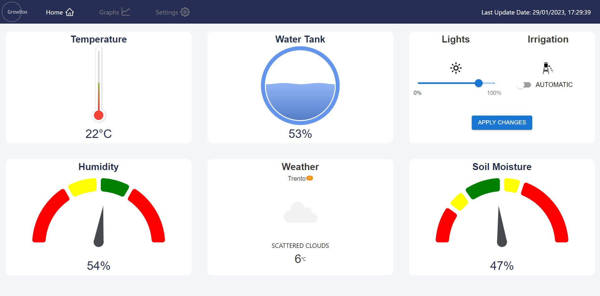
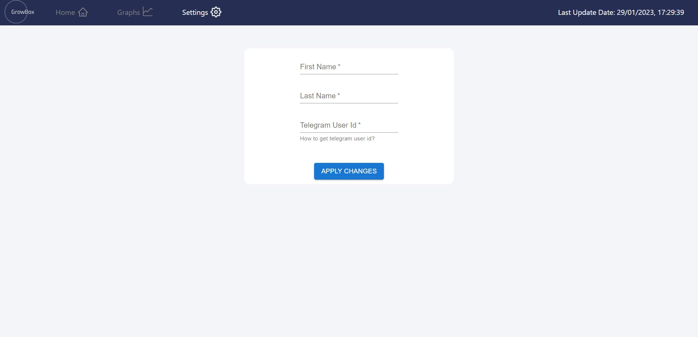

# GROW BOX  


GROW BOX was made to control and monitor a home plant.
Our project uses several sensors to monitor the plant and shows this data on a well-designed web site.

In addition, you can control the light and the irrigation from the website. 



Moreover, you can add your personal details to get notified when the water tank needs to be fulfilled.




You can also check our cool graphs that show you the data from the past week.


## Requirements

### Hardware Requirements

- MSP432 
- Node MCU
- Soil Moisture Sensor
- DHT Sensor
- Ultrasonic Sensor
- Power Supply
- LED Strip
- Water Pump
- Wires


### Software Requirements

- Energie IDE
- Arduino IDE
- Node js installed


## Project Layout

```
├── emb-grow-box
    ├── emb-growbox-msp 
            ├── Timer.cpp   #Timer interrupt helper
            ├── Timer.h  
            ├── tuttoetutto.ino # source code
    ├── emb-grow-box-arduino 
            ├── new_arduino_wifi.ino # source code 
    ├── emb-grow-box-telegram-bot 
            ├── placeholder # source code 
    ├── emb-growbox-client 
            ├── build   
            ├── public   
            ├── src   #source code
                ├── .... all client code 
            ├── stuff 
            ├── .gitignore
            ├── package.json
            ├── tailwind.config.js

```

## How to Build,Burn and Run

### MSP:
#### Build:
-
    Connect pin #3 of MSP to pin D8 of NodeMCU
-
    Connect pin #4 of MSP to pin RX of NodeMCU
-  Sensors connections(PLACEHOLDER):

#### Burn:
-
    Burn using Energie IDE  


### NodeMCU:
#### Build:
-
    Install ESP8266WiFi,Firebase_ESP_Client,NTPClient &         SoftwareSerial libraries.

-  Change the Wifi credentials.
    

#### Burn:

- Burn using Arduino IDE  
 

### Client:
    Run: 
    npm install
    npm start


## Important links

 - [Power Point Presentation](https://awesomeopensource.com/project/elangosundar/awesome-README-templates)
 - [Demo](https://github.com/matiassingers/awesome-readme)


## Team members

- Andrea Bassi
- Imri Koch
- Stefano Antonio Putelli


All members worked together on all the features (pair programming)


## Acknowledgments

<a href="https://www.unitn.it/"></a> <a href="https://ege.edu.tr/"></a>
